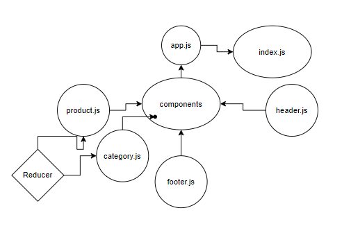

## StoreFront App
- Our application will power an online storefront that will allow our users to browse our product offerings by category
 - place items in their shopping cart
 - check-out when they are ready to make their purchase
##### By: Abdalrhman Albdahat

##### Link:[netlify store app](https://boodah96-storefront.netlify.app/)
 
 ### UML Diagram
 

 ## In storefront-app:
- list of available product categories in the store so that I can easily browse products
- I you want to choose a category and see a list of all available products matching that category
- easy to use user interface so that I can shop the online store with confidence 

 ### installation
 - clone the repo
 - npm i
 - go 